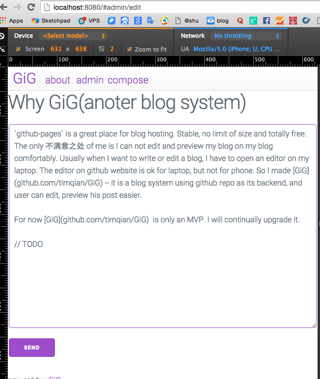

Likes github static pages but want to manipulate content on the page?

Likes ghost but hate to mantain a server?

Then this is for you!

## Demo: http://timqian.com/GiG

## Usage

0. create a `repo` to host the project
1. clone this repo
2. install dependencies: `npm install`
3. fill in your `username` and `repo` in `src/config.js`
2. build the project: `npm run build`
3. push the content to your repo and set `gh-pages` as main branch

## Commends

- `npm install`: install dependencies
- `npm start`: start webpack dev server
- `npm run build`: build using webpack

## Note:

This is only an MVP version, Lots of things can be improved. Any comment and suggentions are welcomed.

## License

MIT
